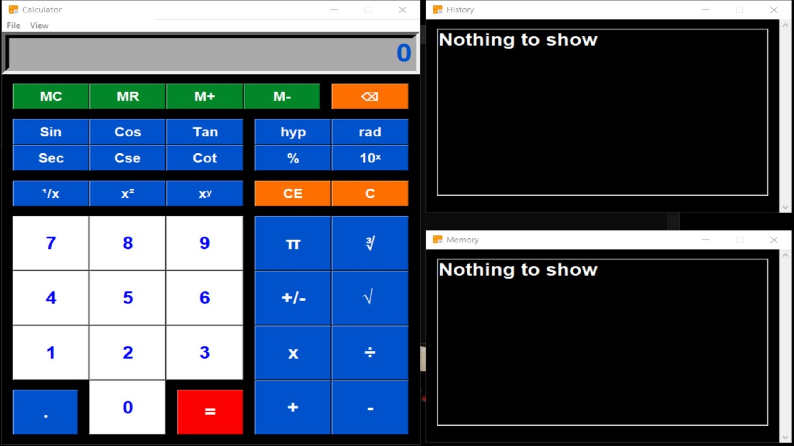

# Tkinter_Calculator

A Simple Calcullator Using Python (Tkinter GUI)

## Python Project

[Go to CHANGELOG](CHANGELOG.md)

## ❔Questions

If you found a bug, have a question or an idea, please check [Tkinter_Calculator contribution guide](CONTRIBUTING.md) and don't hesitate to create new issues [Tkinter_Calculator ISSUE_TEMPLATE](ISSUE_TEMPLATE.md).

## License
[MIT](https://choosealicense.com/licenses/mit/)
